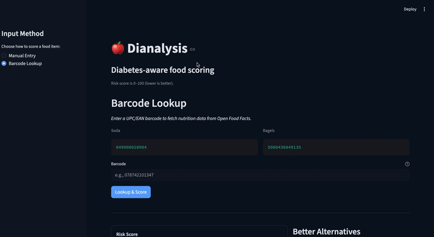
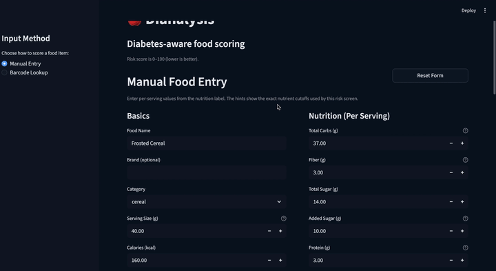

# Dianalysis

[](LICENSE)

Diabetes-risk screening for packaged foods using simple nutrition rules, machine-learning models (`logreg` or `xgboost`), and alternative recommendation ranking.

## Tech Stack

- Language: Python `3.11`
- App UI: Streamlit
- ML: scikit-learn (Logistic Regression), XGBoost (optional)
- Data: pandas, NumPy
- Data/versioning pipeline: DVC
- Experiment tracking: MLflow (optional, used in experiment workflows)
- Container: Docker
- Retrieval: Qdrant vector search (default) with heuristic fallback
- Data source: [Open Food Facts API](https://world.openfoodfacts.org/data)

## Project Docs

- Retrieval method (how alternatives are found and ranked): [`docs/retrieval_methodology.md`](docs/retrieval_methodology.md)
- Qdrant setup (local + cloud): [`docs/qdrant_setup.md`](docs/qdrant_setup.md)
- Labeling rules and thresholds: [`docs/labeling_logic/rule_grounding.md`](docs/labeling_logic/rule_grounding.md)
- Test guide (what tests cover and how to run them): [`tests/README.md`](tests/README.md)
- Contribution workflow: [`docs/contributing.md`](docs/contributing.md)
- Release/tag workflow: [`docs/releasing.md`](docs/releasing.md)

## Demo

Barcode Lookup:



Manual Entry:



## System Overview

```mermaid
flowchart LR
    A[Open Food Facts + Input CSV] --> B[Cleaning and Dedupe]
    B --> C[Build Nutrition Fields + Rule Labels]
    C --> D[Train Model: LogReg or XGBoost]
    D --> E[Artifacts: model + meta]
    E --> F[Rescore Candidate Pool]
    F --> G[Qdrant Index (semantic retrieval)]
    E --> H[Streamlit App]
    G --> H
    H --> I[Risk Score + Explanations + Alternatives]
```

The app uses Qdrant retrieval by default. If Qdrant is unavailable, it falls back to built-in heuristic matching.
For retrieval details, see [`docs/retrieval_methodology.md`](docs/retrieval_methodology.md).

## Architecture

- Data prep: OFF ingestion + cleanup in `dianalysis/off_pipeline.py`
- Rule scoring + label logic: `dianalysis/model_components.py`
- Model training: `train.py` (writes `artifacts/`)
- App serving: `app.py` + `dianalysis/scoring/`
- Recommendations: `dianalysis/recommendation/`
- Retrieval behavior details: [`docs/retrieval_methodology.md`](docs/retrieval_methodology.md)

## Model Features and Training Label

The model uses nutrition numbers plus food category to estimate screening risk.

- Main numeric inputs: carbs, sugar, added sugar, fiber, protein, fat, sodium, serving size, calories
- Category input: `category` (examples: `bread`, `drink`, `snack`)
- Derived helper field: `net_carbs_g = max(carbs_g - fiber_g - sugar_alcohols_g, 0)`

Labeling is rules-based and used for training:

- `label = 1` when rule points are `>= 2`, otherwise `0`
- This is a training helper label, not a diagnosis label

Score output includes a `data_confidence` flag:

- `high`: key nutrition fields were present
- `low`: one or more important fields were missing

For full rule definitions, thresholds, and comparison results:

- [`docs/labeling_logic/rule_grounding.md`](docs/labeling_logic/rule_grounding.md)
- [`docs/labeling_logic/results/threshold_comparison_products_off_clean.md`](docs/labeling_logic/results/threshold_comparison_products_off_clean.md)

For how risk score numbers map to display labels like `Very low (<1)` and `Very high (>99)`, see the "Risk Score Display Buckets" section in [`docs/labeling_logic/rule_grounding.md`](docs/labeling_logic/rule_grounding.md).
For carb-only positive items (no high added sugar/sodium), the app may cap the displayed score at `85`; ranking logic still uses the raw model score.

## Notebooks

- [`dianalysis/dianalysis.ipynb`](dianalysis/dianalysis.ipynb): interactive deep dive for data checks, model training/evaluation, threshold tuning, calibration, and model comparisons.

## Requirements

- Python `3.11`
- Docker + Docker Compose (optional, for containerized runs)

## Setup

```bash
git clone https://github.com/edebbyi/dianalysis.git
cd dianalysis

python -m venv venv
source venv/bin/activate  # Windows: venv\Scripts\activate
pip install -r requirements.txt
```

## Quickstart

### Local

Train artifacts:

```bash
python train.py --config configs/base.toml
```
Builds model files in `artifacts/` from the current data and config.

Run quality gate:

```bash
python experiments/model_quality_gate.py --config configs/base.toml
```
Checks key model metrics against pass/fail thresholds and writes a report.

Start app:

```bash
streamlit run app.py -- --config configs/base.toml
```
Starts the local Streamlit app with the base config.

Use XGBoost profile:

```bash
python train.py --config configs/base.toml --profile configs/profiles/xgboost.toml
streamlit run app.py -- --config configs/base.toml --profile configs/profiles/xgboost.toml
```
Trains and runs the app with the XGBoost [profile](#profiles) settings.

### Docker / Makefile

Run app in Docker:

```bash
make app
make app-logs
make app-stop
```

Run app in Docker with live code mount:

```bash
make app-dev
make app-dev-logs
make app-dev-stop
```
Use `make app-dev` during active coding. Rebuild only when dependencies or Docker image layers change.

Docker performance notes:
- Embedding weights are preloaded at image build time (controlled by `PRELOAD_EMBED_MODEL`, default `1`).
- Hugging Face model cache is stored in the named Docker volume `hf_cache`, so container restarts do not re-download model files.
- Docker builds use CPU-only Torch by default (`DIANALYSIS_TORCH_VERSION=2.5.1+cpu`) to avoid very large CUDA downloads.
- To change the embedding model, set `DIANALYSIS_EMBED_MODEL` before `make app` and rebuild.

Run retrieval sync in Docker (same dependency environment as app):

```bash
make sync-retrieval-docker
make verify-sync-docker
```

If you changed Docker dependencies and need a fresh ops image:

```bash
make sync-retrieval-docker DOCKER_SYNC_BUILD=--build
```

Run app on host Python:

```bash
make app-local
```

Train XGBoost:

```bash
make train-xgb        # dockerized
make train-xgb-local  # host python
```

## Update Recommendation Data

Use this when your product data changes and you want the app's recommendations to stay up to date.

Recommended flow:

```bash
python experiments/dedupe_source_csv.py
python experiments/rescore_candidates.py --auto-train-if-missing
```
- `dedupe_source_csv.py` removes duplicate products from the source CSV.
- `rescore_candidates.py` rebuilds recommendation scores and only trains a model if artifacts are missing.

Normalize category labels (optional, before rescoring):

<details>
<summary>Show optional normalization commands</summary>

```bash
make normalize-labels
make normalize-labels-write
make normalize-labels-inplace
```

```bash
python experiments/normalize_category_labels.py
python experiments/normalize_category_labels.py --write
python experiments/normalize_category_labels.py --write --in-place
```
- `make normalize-labels` / `python ...` (no `--write`): preview only, no file changes.
- `make normalize-labels-write` / `python ... --write`: writes a new file (`*_normalized.csv`).
- `make normalize-labels-inplace` / `python ... --write --in-place`: overwrites the input file.

</details>

## Promote a Model Run to Production

Use this flow to train a candidate model, evaluate it, then make it the active model used by the app.

```bash
RUN=xgb_$(date +%Y%m%d_%H%M%S)
make train-xgb RUN=$RUN
make eval RUN=$RUN
make prod-sync RUN=$RUN
```

Docker equivalent for sync/verify (recommended if host Python has Torch/NumPy issues):

```bash
make prod-sync-docker RUN=$RUN
```

Command notes:
<details>
<summary>Show promotion checks and naming rules</summary>

- `make train-xgb RUN=$RUN`: trains a candidate model and saves temporary run files in `artifacts_tmp/<RUN>`.
- `make eval RUN=$RUN`: runs evaluation for that same run and writes a run-specific report in `reports/`.
- `make prod RUN=$RUN`: checks that run naming matches model type, backs up current `artifacts/`, then promotes `artifacts_tmp/<RUN>` to active `artifacts/`.
- `make sync-retrieval`: rescoring + Qdrant refresh using promoted `artifacts/`, and stamps `model_fingerprint` into CSV/Qdrant payloads.
- `make verify-sync`: verifies `artifacts/`, scored CSV, and Qdrant payload metadata all match.
- `make prod-sync RUN=$RUN`: runs `prod` + `sync-retrieval` + `verify-sync` as one release-safe command.

Naming rule:
- Use run IDs prefixed with `xgb_` or `logreg_` so checks and reporting are consistent.

</details>

## Configuration

Primary config:
- `configs/base.toml`

### Profiles
<details>
<summary>Show profile details</summary>

- A profile is an extra config file that overrides selected settings from `configs/base.toml` for a specific use case.
- `configs/profiles/xgboost.toml`
- `configs/profiles/release_xgboost_qdrant.toml`

Precedence:
- `CLI flags > profile config > base config`

Resolved config snapshots:
- `artifacts/run_configs/train_resolved_config.json`
- `reports/rescore_resolved_config.json`
- `reports/model_quality_resolved_config.json`

</details>

## Key Paths

<details>
<summary>Show key paths</summary>

- `artifacts/`: active model artifacts used by app/scoring.
- `data/products_off_clean.csv`: cleaned OFF source catalog.
- `data/products_off_clean_scored.csv`: local scored candidate output (generated by `make refresh` / `experiments/rescore_candidates.py`).
- `reports/ci_products_off_clean_scored.csv`: CI smoke-run scored candidate output.
- `dianalysis/scoring/`: scoring package (`pipeline.py`, `explanations.py`, `barcode.py`).
- `experiments/normalize_category_labels.py`: category label cleanup helper before rescoring.
- `experiments/rescore_candidates.py`: refresh/train/index orchestration.
- `experiments/verify_retrieval_sync.py`: artifact/CSV/Qdrant identity verification.
- `experiments/model_quality_gate.py`: pass/fail metrics gate.

</details>

## Retrieval Setup

Qdrant is the default retrieval backend.
Most users can use the Makefile flow (`make app`, `make app-dev`, `make sync-retrieval-docker`) without manual setup.
For the full retrieval logic, see [`docs/retrieval_methodology.md`](docs/retrieval_methodology.md).
For local/cloud setup details (including the default 384 embedding dimension), see [`docs/qdrant_setup.md`](docs/qdrant_setup.md).

If deploying on Streamlit Community Cloud with Qdrant Cloud, add these in app secrets:

```toml
DIANALYSIS_RETRIEVAL_BACKEND = "qdrant"
QDRANT_URL = "https://<your-cluster-url>"
QDRANT_API_KEY = "<your-api-key>"
DIANALYSIS_QDRANT_COLLECTION = "dianalysis_products"
DIANALYSIS_EMBED_MODEL = "sentence-transformers/all-MiniLM-L6-v2"
```

Local secret storage and connection test:

```bash
cp .env.example .env
# edit .env with your real Qdrant URL + API key
make qdrant-check
```

What `make qdrant-check` does:
- loads values from `.env` (if present)
- connects to Qdrant using `QDRANT_URL` + `QDRANT_API_KEY`
- verifies the configured collection exists

<details>
<summary>Show manual host setup commands</summary>

```bash
docker run --rm -p 6333:6333 qdrant/qdrant
DIANALYSIS_RETRIEVAL_BACKEND=qdrant python experiments/build_qdrant_index.py --recreate
DIANALYSIS_RETRIEVAL_BACKEND=qdrant streamlit run app.py
```

</details>

Optional refresh modes:

<details>
<summary>Show optional Qdrant refresh modes</summary>

```bash
python experiments/rescore_candidates.py --qdrant-mode upsert
python experiments/rescore_candidates.py --qdrant-mode prune
python experiments/rescore_candidates.py --train --model-type xgboost --qdrant-mode recreate
```
- `upsert`: add/update vectors.
- `prune`: add/update vectors and remove stale ones.
- `recreate`: rebuild full index from scratch.

</details>

## Contributing

See [`docs/contributing.md`](docs/contributing.md) for the contribution and PR workflow.

## Release

See [`docs/releasing.md`](docs/releasing.md) for version tag commands.

## License

MIT

## Sources

For how label rules were defined, tested, and chosen, see [`docs/labeling_logic/rule_grounding.md`](docs/labeling_logic/rule_grounding.md).

- FDA %DV “5/20” rule (low vs high): https://www.fda.gov/food/new-nutrition-facts-label/lows-and-highs-percent-daily-value-new-nutrition-facts-label
- FDA Daily Values table (`50g` added sugar, `2300mg` sodium, `28g` fiber, `50g` protein): https://www.fda.gov/food/new-nutrition-facts-label/daily-value-new-nutrition-and-supplement-facts-labels
- American Diabetes Association (ADA) carb guidance (total carbs): https://diabetes.org/food-nutrition/understanding-carbs/get-to-know-carbs
- Centers for Disease Control and Prevention (CDC) carb counting (`~15g` per carb serving): https://www.cdc.gov/diabetes/healthy-eating/carb-counting-manage-blood-sugar.html
- FDA update on “healthy” nutrient-content claim: https://www.fda.gov/food/hfp-constituent-updates/fda-finalizes-updated-healthy-nutrient-content-claim
