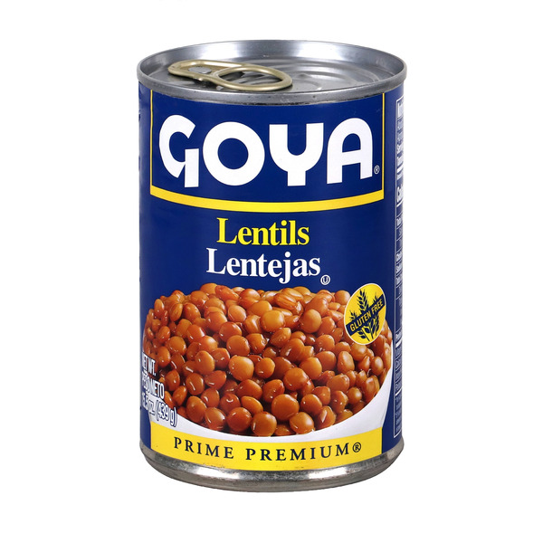
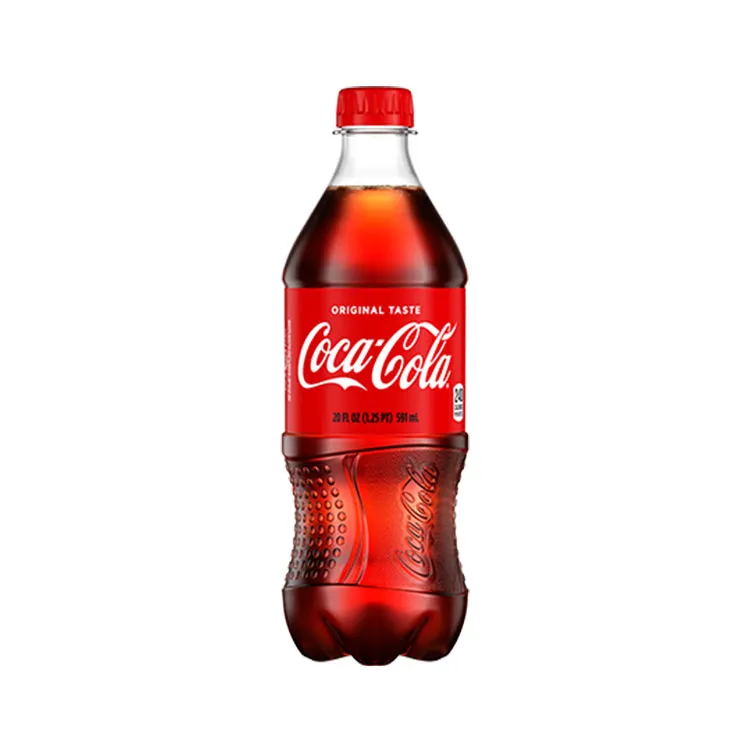

# Labeling Logic and Calibration

This document explains why the current rule-based labeling logic exists, which sources support it, and how threshold comparisons were evaluated on the current dataset.

## Scope

- This is a **simple screening rule** for packaged-food risk labeling, not a clinical diagnosis tool.
- The rule-based label is a helper label used to train the model and explain results.

## Active Rules (Current)

Per serving:

- `carbs_g >= 30` -> `+2`
- Beverage-like items use `carbs_g >= 20` -> `+2`
- `added_sugar_g >= 10` -> `+2`
- If `added_sugar_g` is missing for processed-food categories (`drink`, `snack`, `dessert`), use `sugar_g >= 10` as an inferred sugar risk signal -> `+2`
- `sodium_mg >= 460` -> `+1`
- `fiber_g >= 5.6` -> `-2`
- `protein_g >= 10` -> `-1`
- Empty-calorie penalty: if sugar is high and fiber/protein/fat are near zero -> `+1`
- Positive label: `score >= 2`

Implementation location:

- [dianalysis/model_components.py](/Users/esosa/Documents/GitHub/dianalysis/dianalysis/model_components.py)

## Why Total Carbs for Labeling (and Net Carbs as Context)

- We use **total carbs** (`carbs_g`) for the carb trigger to align with standardized nutrition labeling.
- We keep `net_carbs_g` as a model feature and extra context feature, but not the primary label trigger.

Reason:

- [American Diabetes Association (ADA)](https://diabetes.org/food-nutrition/understanding-carbs/get-to-know-carbs) notes that "net carbs" is not standardized for label-based decision-making and recommends using total carbs as the base metric.
- [Centers for Disease Control and Prevention (CDC)](https://www.cdc.gov/diabetes/healthy-eating/carb-counting-manage-blood-sugar.html) carb-counting guidance uses standardized carb servings (`~15g`), so `30g` corresponds to about two carb servings.

## Why These Thresholds

## Source table

| Feature | Current Rule | Why this threshold |
|---|---:|---|
| Total carbs | `>= 30g` (+2); beverage-like items `>= 20g` (+2) | Keeps the broad meal-style threshold while preventing small sugary drinks from slipping through. |
| Added sugar | `>= 10g` (+2) | `10g` is 20% of FDA DV (`50g`), matching "high" (%DV) logic. |
| Missing added sugar fallback | If added sugar missing and item is processed (`drink`, `snack`, `dessert`), use `sugar_g >= 10g` (+2) | Avoids false low-risk calls when source data omits added sugar for highly processed foods. |
| Sodium | `>= 460mg` (+1) | `460mg` is 20% of FDA DV (`2300mg`), matching "high" (%DV) logic. |
| Fiber | `>= 5.6g` (-2) | `5.6g` is 20% of FDA DV (`28g`), treated as a strong protective signal. |
| Protein | `>= 10g` (-1) | `10g` is 20% of FDA DV (`50g`), treated as minor protective support (satiety context). |
| Empty-calorie penalty | If `sugar_g > 10g` and fiber/protein/fat are near zero, `+1` | Captures high-sugar, low-buffer products that are metabolically weak despite low sodium/carb totals. |

## Scoring Examples

These examples show how the same carb amount can score differently depending on nutrient quality.

- **High-carb + high-fiber example:**
  
  - A high-fiber food might have about `30g` carbs (`+2`) and `>= 5.6g` fiber (`-2`).
  - Total score can be `0` (or `1` if sodium/protein differ), so it may **not** be labeled high risk.
- **High-carb + low-fiber example:**
  
  - A low-fiber product with `>= 30g` carbs gets `+2` from carbs and no fiber offset.
  - It can cross the risk threshold quickly, especially with added sugar or sodium.
- **One-serving sugar example:**
  
  - Exactly `10g` added sugar in one serving gives `+2` by itself (20% DV in one serving).
  - This is intentional because the threshold is aligned to FDA "high" logic.
- **Soda-like pattern example:**
  
  - A drink with high carbs/added sugar and near-zero fiber usually scores as risk-positive because protective offsets are absent.

In short: the system does not treat all carbs the same. It rewards carb sources that come with protective nutrients (especially fiber), and flags high-load carbs with weak nutrient support.

## Threshold Comparison Results

Dataset used: `data/products_off_clean.csv` (`n=431`)  
Evaluation date: `2026-04-20`
Reproducible run commands: `make threshold-compare` or `python experiments/threshold_comparison.py --input-csv data/products_off_clean.csv --output-json docs/labeling_logic/results/threshold_comparison_products_off_clean.json --output-md docs/labeling_logic/results/threshold_comparison_products_off_clean.md`  
Saved run outputs: `docs/labeling_logic/results/threshold_comparison_products_off_clean.json` and `docs/labeling_logic/results/threshold_comparison_products_off_clean.md`

| Rule set | Positive trigger | Positive label rate |
|---|---:|---:|
| Legacy rules (`net>20,+2`; `add>=8,+2`; `sod>=500,+1`; `fiber>=5,-2`; `protein>=12,-1`) | `>= 2` | `41.30%` |
| Balanced rules (`net>=25,+1`; `add>=10,+2`; `sod>=460,+1`; `fiber>=5.6,-2`; `protein>=10,-1`) | `>= 2` | `8.35%` |
| Balanced rules (same thresholds, stricter trigger) | `>= 3` | `3.94%` |
| Current adopted rules (`carbs>=30,+2`; `add>=10,+2`; `sod>=460,+1`; `fiber>=5.6,-2`; `protein>=10,-1`) | `>= 2` | `24.59%` |
| Current adopted rules (same thresholds, stricter trigger) | `>= 3` | `5.57%` |

Why we keep `>= 2` (not `>= 3`):

- `>= 3` under-flags in this dataset (about `5.57%`), requiring multiple strong risk signals before anything is labeled.
- `>= 2` gives a more useful screening rate (`24.59%`) and better separates nutrient-dense from low-quality high-load foods.
- Interpretation: `>= 2` catches meaningful risk patterns earlier, while `>= 3` is too restrictive for screening.

## Practical Interpretation

- The system is designed to measure the balance between risk nutrients and protective nutrients, not "carbs are always bad."
- Protective nutrients (fiber/protein) can offset risk nutrients in mixed-quality foods.
- A high-carb item can avoid a positive label if protective nutrients are present at meaningful levels.
- FDA alignment is explicit in this ruleset: added sugar (`10g`) and sodium (`460mg`) are both set at 20% DV ("high") per serving.

## Known Edge Case

- Exactly `10g` added sugar contributes `+2`, which can trigger a positive label by itself if no protective offsets are present.
- This is intentional: `10g` equals 20% DV for added sugar in one serving.
- Some carb-heavy, lower-sugar foods can still receive high model risk scores because the current model was trained on rule-based labels that heavily weight carb thresholds.

## Next Version Focus

- In the next version, we plan to improve model calibration so carb-heavy foods without strong sugar/sodium signals are less likely to appear overly high-risk.
- Goal: keep the same screening logic, but better align score intensity with real nutrient pattern differences.

## Risk Score Display Buckets

The app computes a raw probability (`prob_risky`) and then shows both:

- `risk_score` (0 to 100): `round(prob_risky * 100)`
- `risk_display` (user-facing label)

Display rules:

- If probability is `< 0.5%` -> `Very low (<1)`
- If probability is `> 99.5%` -> `Very high (>99)`
- Otherwise -> rounded score (for example `73`)

What `>99` means in practice:

- It is the display bucket for probabilities above `99.5%`.
- The numeric `risk_score` at that point is effectively `100` after rounding.
- We show `>99` instead of always printing `100` to avoid false precision.

Display-only cap for carb-only positives:

- For items that are risk-positive mainly from high carbs (without high added sugar and without high sodium), the app caps the **displayed** score at `85`.
- This cap is presentation-only for the main score card.
- Internal ranking/filtering still uses the raw model score.

## Data Confidence

- Score output includes a `data_confidence` flag (`high` or `low`).
- `low` means one or more critical fields were missing in source data (for example missing added sugar in a processed-food category).
- In low-confidence cases, explanations call out the missing fields so the user can interpret results cautiously.

## Sources

- FDA %DV "5/20" guidance (low/high):  
  https://www.fda.gov/food/new-nutrition-facts-label/lows-and-highs-percent-daily-value-new-nutrition-facts-label
- FDA Daily Values table (`50g` added sugar, `2300mg` sodium, `28g` fiber, `50g` protein):  
  https://www.fda.gov/food/new-nutrition-facts-label/daily-value-new-nutrition-and-supplement-facts-labels
- ADA on carbs and net-carb caveat (use total carb grams):  
  https://diabetes.org/food-nutrition/understanding-carbs/get-to-know-carbs
- CDC carb counting (`~15g` carb serving):  
  https://www.cdc.gov/diabetes/healthy-eating/carb-counting-manage-blood-sugar.html
- FDA "healthy" claim rule update context:  
  https://www.fda.gov/food/hfp-constituent-updates/fda-finalizes-updated-healthy-nutrient-content-claim
