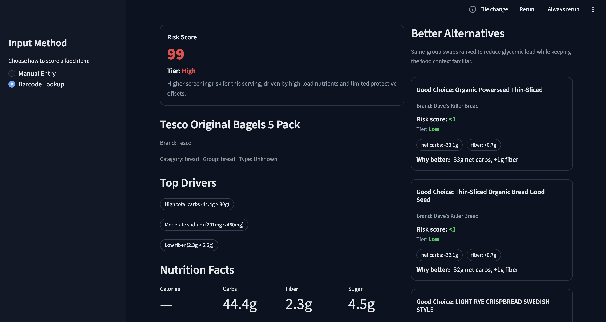
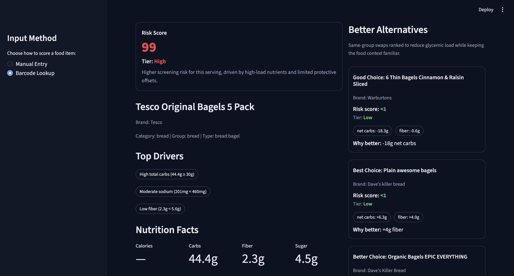

# Retrieval Methodology

This doc explains, in plain language, how Dianalysis picks alternatives.

## Goal

When you score a food, the app tries to return alternatives that are:

- In the same food context (for example, soda to soda, bagel to bagel)
- Lower risk than the original item
- Easy to compare using clear nutrition deltas

## Main Idea

Dianalysis does retrieval in two steps:

1. **Find good candidates**
2. **Rank them and keep only the best few**

It uses Qdrant by default for candidate search.

For local/cloud connection setup and env variables, see [`docs/qdrant_setup.md`](qdrant_setup.md).

## Visual Example: Before vs After Fine Grouping

Before `alt_group_fine` was enforced, bagel queries were treated as generic bread.



- Before: `Type: Unknown`
- Before: alternatives include broad bread items (not specifically bagels)

After `alt_group_fine` is enforced (for example `bread:bagel`), bagel queries are constrained to bagel-like alternatives first.



- After: `Type: bread:bagel`
- After: alternatives stay in bagel-like matches

## Fields Used for Matching

These two fields drive retrieval scope:

- `category_main`: broad family (for example `drink`, `bread`, `snack`)
- `alt_group_fine`: narrower type (for example `drink:soft_drink`, `bread:bagel`)

This keeps recommendations relevant to the original food.

## Candidate Search Flow

When a food is scored:

1. Try to retrieve from the same `alt_group_fine` first.
2. If that is too small, widen to `category_main`.
3. Remove the exact same product (same UPC or same normalized name+brand).

## Ranking Flow

After retrieval, candidates are ranked by a blend of:

- Lower risk score than the current item
- Better nutrition direction (lower carbs/sugar, higher fiber when possible)
- Similarity to the query (vector similarity + text alignment)
- Subtype alignment bonus (exact `alt_group_fine` match)

Then Dianalysis:

- Drops duplicates
- Keeps the top 3
- Labels them as `Best`, `Better`, `Good`

## Guardrails

The system applies extra checks so results do not feel random:

- Soft-drink queries stay in soft-drink style results (no water/milk leakage)
- Alternative risk must be lower than the current product
- If no valid lower-risk alternatives are found, the app returns none

## Why You Might See No Alternatives

This is expected when:

- The item is already low risk
- The dataset has no lower-risk items in that same subgroup
- Matching candidates fail subtype/style filters

In that case, the app should show a clear “no lower-risk alternatives found” message.

## Retrieval Metrics (Quality Gate)

We track retrieval quality with metrics that match product behavior.

- `eligibility_rate`:
  - Share of queries where at least one valid lower-risk candidate exists in scope.
- `coverage_with_alternatives`:
  - Share of queries where we returned at least one alternative.
  - Useful as context, but not the main gate metric.
- `coverage_given_eligible`:
  - Of eligible queries only, how often we returned alternatives.
  - This is the retrieval coverage gate metric.
- `ndcg_at_k_mean`:
  - Average ranking quality across all queries (including empty lists).
  - Useful as context.
- `ndcg_given_non_empty`:
  - Ranking quality only on queries where alternatives were returned.
  - This is the retrieval ranking gate metric.

Why this matters:

- If no valid lower-risk alternatives exist, returning none is correct behavior.
- These metrics avoid treating every empty result as a retrieval failure.

## Keeping Retrieval in Sync After Model Updates

After promoting new model artifacts, refresh retrieval so ranking uses the same model state:

```bash
make prod-sync-docker RUN=<run_id>
```

This command:

- Promotes artifacts
- Re-scores candidate rows
- Rebuilds Qdrant payloads
- Verifies artifact/CSV/Qdrant fingerprints match

## Quick Debug Checklist

If alternatives look off:

1. Check the item subtype (`alt_group_fine`) in output.
2. Confirm the query item is classified correctly (for example soda vs water).
3. Re-run sync:
   - `make sync-retrieval-docker`
   - `make verify-sync-docker`
4. Re-test with known barcodes:
   - `049000028904` (Coca-Cola Original Taste Soda)
   - `072945601369` (Honey Wheat Bread)
